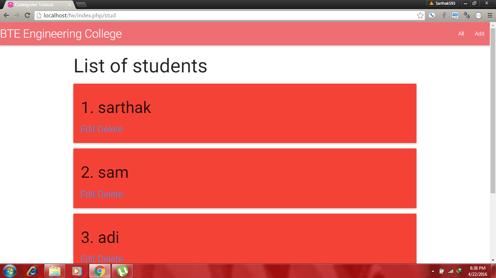
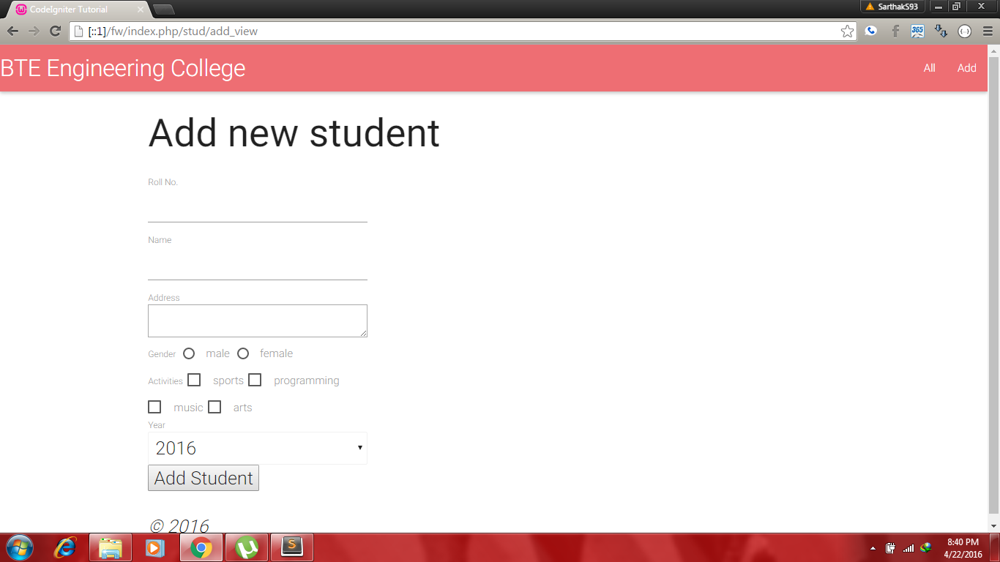
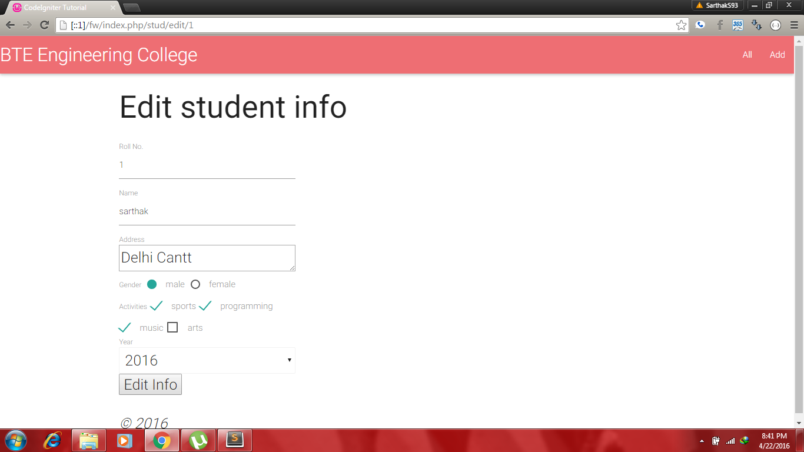

Simple web app for student management system.
This is a test repo to practice php's Codeigniter framework.

Place the folder where your server is placed.
For example-
I used wamp so i put the folder in the www directory of wamp.

To run-
Run wamp server and then type
'localhost/squareboat/fw/index.php/stud' in your browser.

Screenshots

